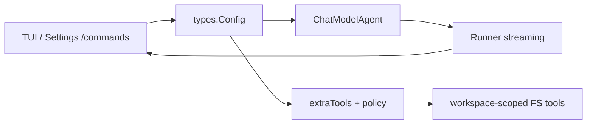

# Chat-TUI PRD — 通用 Agent P0（v0.9）

## 1. 一句话

在现有 Eino 多提供商流式 Agent 上，补齐「默认人格 + 迭代上限 + 工作区沙箱 + 可发现工具 + 可关危险能力」，使 chat-tui 更接近通用终端 Agent。

## 2. 问题

用户反馈工具已接入，但 Agent 仍偏「裸聊天」：没有稳定指令、容易在文件系统上乱跑、缺少搜索类能力，也无法一眼看到 Agent 运行参数。

## 3. 方案概览

### 3.1 配置扩展（`types.Config`）

| 字段 | JSON | 默认 | 说明 |
|------|------|------|------|
| MaxIterations | `max_iterations` | 20 | 模型生成轮次上限 |
| WorkspaceRoot | `workspace_root` | `""` → cwd | 工具沙箱根 |
| DisableWriteFile | `disable_write_file` | false | true 时不注册 write_file |
| DisableRunCommand | `disable_run_command` | false | true 时不注册 run_command |
| AgentName | `agent_name` | `chat-tui` | ADK Name |
| UseDefaultInstruction | `use_default_instruction` | true | system 空时注入默认指令 |

默认 Instruction（摘要，实现里用完整英文或中英双语短文）：

> You are a capable terminal coding agent. Prefer tools to inspect the workspace before answering. Stay inside the workspace. Be concise; when done, call exit if available.

会话级 `systemPrompt`（System Prompts 管理器）优先级高于默认 Instruction。

### 3.2 Agent 组装（`internal/api/agent.go`）

- `Instruction` = 有效 system / 默认指令
- `MaxIterations` = cfg
- `Exit: adk.ExitTool{}`
- `ToolsConfig.Tools` = `extraTools(cfg)`（带策略与 workspace）

### 3.3 工具层（`internal/api/tools.go` + 新文件）

- 引入 `toolEnv{ root string }`；`resolveInWorkspace(path)` 做 Abs + 前缀校验。
- 改造现有 list/read/write/run_command 走 resolve。
- 新增：`glob_files`、`search_text`、`make_directory`。
- `http_get` / `get_current_time` / `get_working_directory` 不受路径沙箱约束（cwd 工具可返回 workspace_root 若已设）。

### 3.4 TUI

- Settings 增加：Max Iterations、Workspace Root、Enable Write File、Enable Run Command（checkbox）。
- `/agent`：状态摘要；`/tools` 反映实际启用列表；`/help` 更新。
- `/config` 带上新字段。
- `write_file` / `run_command` 执行前 TUI Allow/Deny（HITL）。

### 3.5 文档与版本

- 提交 `docs/requirements.md`、`docs/prd.md`。
- README「功能特性」增加工作区沙箱、搜索/glob、可配置迭代与工具策略。
- 建议版本：`v0.9.0`（实现合并后打 tag；与未推送的 `v0.8.1` 可并存：先推 0.8.1 或直接 0.9.0 覆盖工具+通用 Agent）。

## 4. 成功指标（定性）

- 空 system prompt 时 Agent 主动用工具读仓库再回答。
- 设置 `workspace_root` 后，对根外路径的 write/read/run 返回明确错误。
- `enable_run_command=false` 时模型侧看不到该工具；`/tools` 与 `/agent` 一致。
- `go test ./...` 通过。

## 5. 里程碑

| 里程碑 | 内容 | 完成定义 |
|--------|------|----------|
| M1 | 需求 + PRD 合入 | 本目录文档在仓库中 |
| M2 | 配置 + Agent 组装 | 单测 + 本地 build |
| M3 | 工具沙箱与新工具 | tools_test 覆盖 |
| M4 | TUI / README | 命令与 Settings 可用 |
| M5 | 推送 main（可选 tag v0.9.0） | CI/本地 test 绿 |

## 6. 风险

| 风险 | 缓解 |
|------|------|
| 沙箱误伤绝对路径工作流 | 文档说明；允许 workspace 内的绝对路径 |
| search 在大仓库慢 | 超时 + 结果上限 + 优先 rg |
| Settings 表单项索引错乱 | rebuildSettingsForm 用命名取值，避免硬编码 index |

## 7. 决策记录

- **HITL 已落地**：`write_file` / `run_command` 经 `ToolConfirmer` 在 TUI 确认；无 confirmer 时（单测）默认允许。
- **不做**本轮 DeepAgent：复杂度高，先把单 Agent 做稳。
- **ExitTool 默认开**：通用 Agent 惯例；代价低。
- **默认 Instruction 英文为主**：兼容各模型；可后续本地化。
